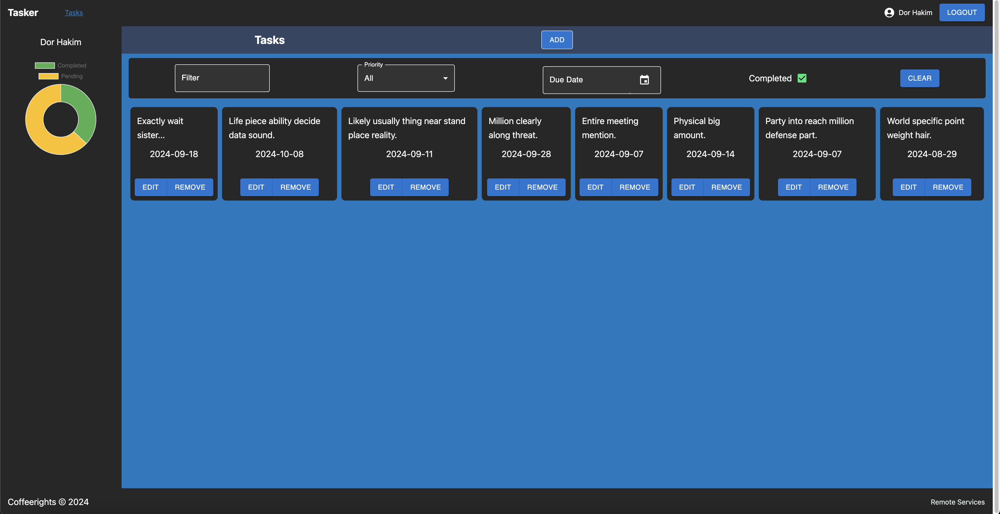

# 📝 Tasker

Welcome to **Tasker**! This app is a task management system that allows users to easily organize their tasks with features like registration, login, task creation, editing, deletion, and filtering. Built with 💻 **React** and managed using ⚛️ **Recoil** for state management, Tasker offers a smooth and interactive experience.

## 🚀 Features

- **User Authentication**: Register and login to manage your tasks. (In order to create edit or delete tasks you have to signup/login)
- **CRUD Operations**: Create, Read, Update, and Delete tasks seamlessly.
- **Task Filtering**: Easily filter tasks based on various criteria.
- **Drag & Drop**: Organize tasks effortlessly using drag-and-drop functionality.
- **Charts**: Visualize your task stats with beautiful charts.

## 🛠️ Built With

- **React**: A JavaScript library for building user interfaces.
- **Recoil**: For managing state in a scalable way.
- **React Beautiful DnD**: For drag-and-drop functionality.
- **Chart.js**: For rendering beautiful charts.
- **Other Libraries**: Includes several other packages to enhance the user experience.

## 📁 Code Structure

Tasker is built with a modular approach, with services to keep the codebase clean and organized. Each feature and functionality is split into different services for better management.

## 📦 Installation

1. Clone the repository:
   ```bash
   git clone https://github.com/yourusername/tasker-frontend.git
   ```
2. Navigate to the project directory:
   ```bash
   cd tasker-frontend
   ```
3. Install the dependencies:
   ```bash
   npm install
   ```
4. Run the development server:
   ```bash
   npm run dev
   ```

## 💡 Usage

- After registering or logging in, you can create new tasks, update them, delete tasks, and even filter tasks by different categories.
- Use drag-and-drop to reorder tasks.
- Check your task statistics with the built-in chart views.

## 🖼️ Screenshots



## 🤝 Contributing

Feel free to contribute to Tasker! Fork the repository and submit a pull request.
